<table align="center" border="0">

<tr><td colspan=2 align="center">

# DeepFaceLab  

<a href="https://arxiv.org/abs/2005.05535">

</img>
https://arxiv.org/abs/2005.05535</a>

</td></tr>
<tr><td colspan=2 align="center">

<p align="center">

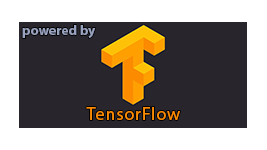
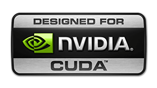
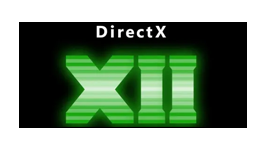

</p>

DeepFaceLab is used by such popular youtube channels as

| [deeptomcruise](https://www.tiktok.com/@deeptomcruise)| [1facerussia](https://www.tiktok.com/@1facerussia)| [arnoldschwarzneggar](https://www.tiktok.com/@arnoldschwarzneggar)
|---|---|---|

| [mariahcareyathome?](https://www.tiktok.com/@mariahcareyathome?)| [diepnep](https://www.tiktok.com/@diepnep)| [mr__heisenberg](https://www.tiktok.com/@mr__heisenberg)| [deepcaprio](https://www.tiktok.com/@deepcaprio)
|---|---|---|---|

| [VFXChris Ume](https://www.youtube.com/channel/UCGf4OlX_aTt8DlrgiH3jN3g/videos)| [Sham00k](https://www.youtube.com/channel/UCZXbWcv7fSZFTAZV4beckyw/videos)|
|---|---|

| [Collider videos](https://www.youtube.com/watch?v=A91P2qtPT54&list=PLayt6616lBclvOprvrC8qKGCO-mAhPRux)| [iFake](https://www.youtube.com/channel/UCC0lK2Zo2BMXX-k1Ks0r7dg/videos)| [NextFace](https://www.youtube.com/channel/UCFh3gL0a8BS21g-DHvXZEeQ/videos)|
|---|---|---|

| [Futuring Machine](https://www.youtube.com/channel/UCC5BbFxqLQgfnWPhprmQLVg)| [RepresentUS](https://www.youtube.com/channel/UCRzgK52MmetD9aG8pDOID3g)| [Corridor Crew](https://www.youtube.com/c/corridorcrew/videos)|
|---|---|---|

| [DeepFaker](https://www.youtube.com/channel/UCkHecfDTcSazNZSKPEhtPVQ)| [DeepFakes in movie](https://www.youtube.com/c/DeepFakesinmovie/videos)|
|---|---|

| [DeepFakeCreator](https://www.youtube.com/channel/UCkNFhcYNLQ5hr6A6lZ56mKA)| [Jarkan](https://www.youtube.com/user/Jarkancio/videos)|
|---|---|

</td></tr>

<tr><td colspan=2 align="center">

# What can I do using DeepFaceLab?

</td></tr>
<tr><td colspan=2 align="center">

## Replace the face

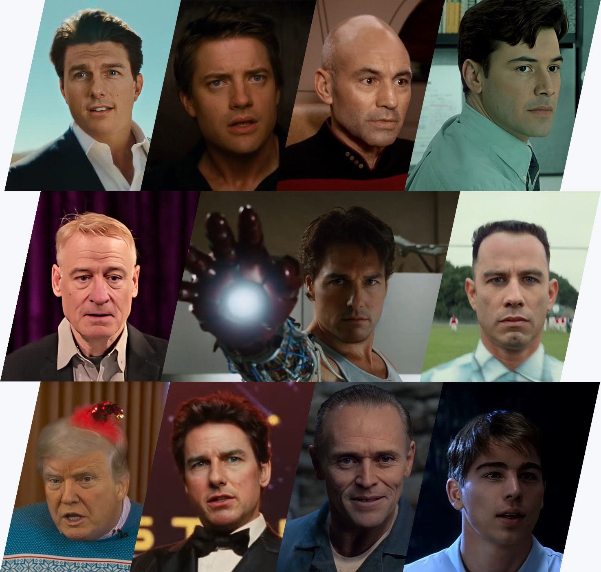

</td></tr>

<tr><td colspan=2 align="center">

## De-age the face

</td></tr>

<tr><td align="center" width="50%">

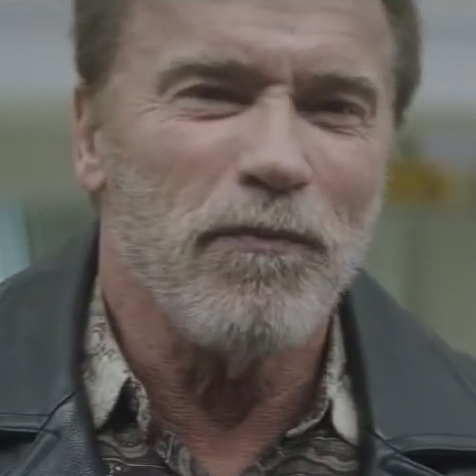

</td>
<td align="center" width="50%">

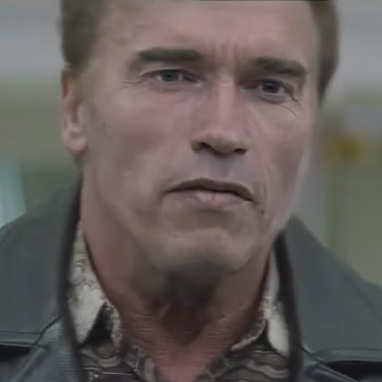

</td></tr>

<tr><td colspan=2 align="center">

 https://www.youtube.com/watch?v=Ddx5B-84ebo

</td></tr>

<tr><td colspan=2 align="center">

## Replace the head

</td></tr>

<tr><td align="center" width="50%">

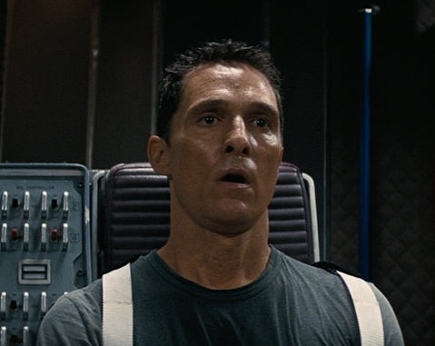

</td>
<td align="center" width="50%">

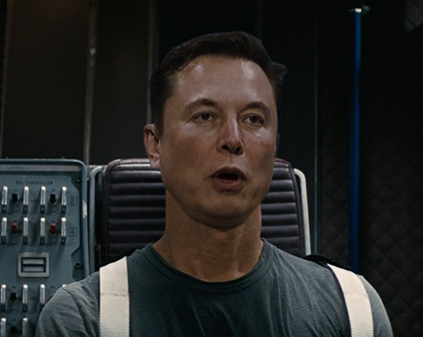

</td></tr>

<tr><td colspan=2 align="center">

 https://www.youtube.com/watch?v=RTjgkhMugVw

</td></tr>

<tr><td colspan=2 align="center">

# Native resolution progress

</td></tr>
<tr><td colspan=2 align="center">

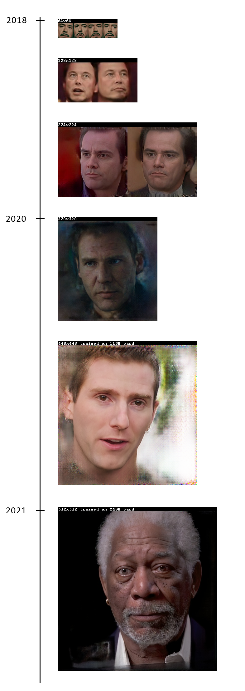

</td></tr>
<tr><td colspan=2 align="center">


Unfortunately, there is no "make everything ok" button in DeepFaceLab. You should spend time studying the workflow and growing your skills. A skill in programs such as *AfterEffects* or *Davinci Resolve* is also desirable.

</td></tr>
<tr><td colspan=2 align="center">

## Mini tutorial

<a href="https://www.youtube.com/watch?v=kOIMXt8KK8M">

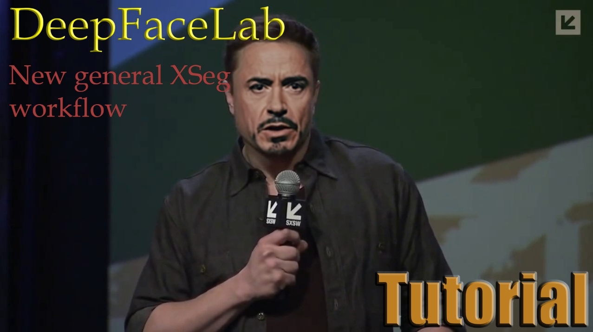

</a>

</td></tr>
<tr><td colspan=2 align="center">

## Releases

</td></tr>

<tr><td align="right">
<a href="https://tinyurl.com/2p9cvt25">Windows (magnet link)</a>
</td><td align="center">Last release. Use torrent client to download.</td></tr>

<tr><td align="right">
<a href="https://mega.nz/folder/Po0nGQrA#dbbttiNWojCt8jzD4xYaPw">Windows (Mega.nz)</a>
</td><td align="center">Contains new and prev releases.</td></tr>

<tr><td align="right">
<a href="https://disk.yandex.ru/d/7i5XTKIKVg5UUg">Windows (yandex.ru)</a>
</td><td align="center">Contains new and prev releases.</td></tr>

<tr><td align="right">
<a href="https://github.com/nagadit/DeepFaceLab_Linux">Linux (github)</a>
</td><td align="center">by @nagadit</td></tr>

<tr><td align="right">
<a href="https://github.com/elemantalcode/dfl">CentOS Linux (github)</a>
</td><td align="center">May be outdated. By @elemantalcode</td></tr>

</table>

<table align="center" border="0">

<tr><td colspan=2 align="center">

### Communication groups

</td></tr>

<tr><td align="right">
<a href="https://discord.gg/rxa7h9M6rH">Discord</a>
</td><td align="center">Official discord channel. English / Russian.</td></tr>

<tr><td colspan=2 align="center">

## Related works

</td></tr>

<tr><td align="right">
<a href="https://github.com/iperov/DeepFaceLive">DeepFaceLive</a>
</td><td align="center">Real-time face swap for PC streaming or video calls</td></tr>

</td></tr>
</table>

<table align="center" border="0">

<tr><td colspan=2 align="center">

## How I can help the project?

</td></tr>

<tr><td colspan=2 align="center">

### Star this repo

</td></tr>

<tr><td colspan=2 align="center">

Register github account and push "Star" button.

</td></tr>

</table>

<table align="center" border="0">
<tr><td colspan=2 align="center">

## Meme zone

</td></tr>

<tr><td align="center" width="50%">

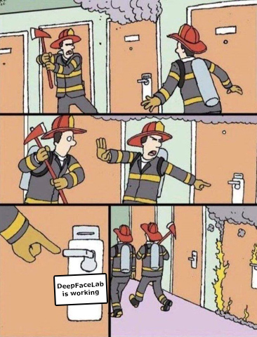

</td>

<td align="center" width="50%">

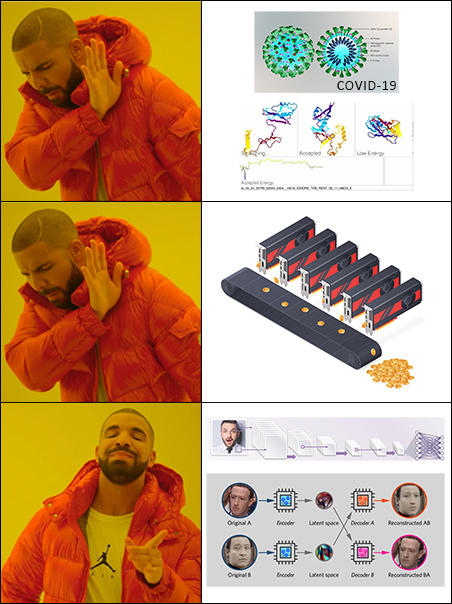

</td></tr>

<tr><td colspan=2 align="center">

<sub>#deepfacelab #faceswap #face-swap #deep-learning #deeplearning #deep-neural-networks #deepface #deep-face-swap #neural-networks #neural-nets #tensorflow #cuda #nvidia</sub>

</td></tr>


</table>

---

## DFL Control Panel

This repository includes a browser-based control panel that wraps the DFL pipeline. It eliminates manual CLI usage and makes the full pipeline operable from a web UI — locally or on a remote cloud GPU machine.

### Pipeline Stages

| Stage | What it does |
|---|---|
| **Extract Src** | Detects and crops faces from source video frames using the S3FD face detector |
| **Extract Dst** | Same process on the destination (target) footage |
| **Train** | Trains a SAEHD autoencoder model on the two face sets until stopped |
| **Merge** | Applies the trained model to every destination frame |
| **Video From Seq** | Reassembles merged frames into an MP4 via ffmpeg |

### Tech Stack

**DFL Pipeline** (Python 3.8, CUDA 11.0, runs in `dfl:latest` Docker image)
- TensorFlow 2.4 with cuDNN 8
- Custom neural network layer library (`core/leras/`) — direct TF graph control, no Keras
- S3FD face detection, 2D/3D FAN landmark extraction (68 or 98 points)
- SAEHD autoencoder architecture (encoder + inter + dual decoders)

**Control Panel Backend** (Python 3.10, runs in `dfl-backend` Docker image)
- FastAPI + uvicorn
- Jinja2 templates + HTMX for reactive UI without a JS framework
- Server-Sent Events (SSE) for live log streaming
- Config, presets, environment profiles, and job history persisted as JSON to the workspace volume

**Infrastructure**
- Two containers via `compose.yaml`: `nginx` (port 80, reverse proxy + SSE tuning) and `backend` (internal port 8000)
- Pipeline stages run as ephemeral `docker run --rm dfl:latest` sibling containers spawned via the mounted Docker socket
- GPU passthrough via NVIDIA Container Toolkit (`--gpus all`)
- nginx is TLS-ready for cloud deployment

### Quick Start

**Requirements:** Docker Desktop with GPU support, NVIDIA driver ≥ 450.80

```bash
# Build images and start the control panel
docker compose up --build -d

# Open the UI
http://localhost
```

Place source frames in `workspace/data_src/` and destination frames in `workspace/data_dst/` before running Extract.

### Workspace Layout

```
workspace/
├── data_src/           # raw source frames
│   └── aligned/        # extracted source faces
├── data_dst/           # raw destination frames
│   └── aligned/        # extracted destination faces
├── model/              # training checkpoints
├── output/             # merged output frames
├── output_mask/        # merge mask images
└── result.mp4          # final video (after Video From Seq)
```

### Key Design Notes

- **Two images:** `dfl:latest` (heavy — CUDA + TF + DFL code) and `dfl-backend` (lightweight — Python 3.10 + FastAPI + Docker CLI). Pipeline stages never run inside the backend container.
- **Stateless containers:** all data lives in the host-mounted workspace. Rebuilding images never affects your data.
- **`command_registry.py`** is the single source of truth for all stage commands and path conversions.
- **`DFL_WORKSPACE_HOST`** passes the real host path through to sibling pipeline containers so volume mounts work correctly when the backend is itself running inside Docker.
